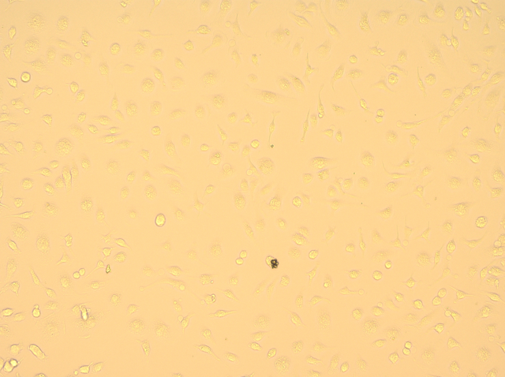
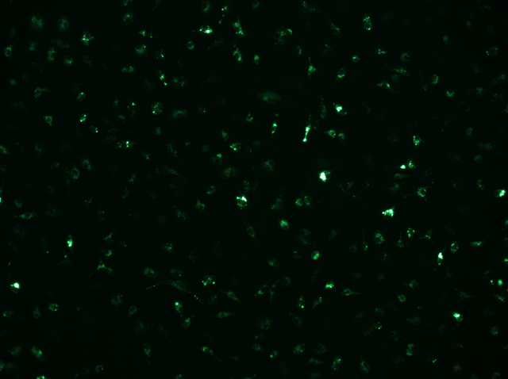

# EZeffero

Quantify fluorescent apoptotic-cell (AC) association with bone marrow-derived macrophages (BMDMs). Cellpose segments brightfield images; fluorescence objects are classified by area and assigned to cell masks. Outputs include per-cell counts, intensities, QC overlays, and provenance logs.

The measurement combines surface-bound and internalized ACs. `phagocytic_strict` means at least one small or large AC object is associated with a cell; it does not establish engulfment. Puncta are counted separately.

## Install

Run commands from the repository root. The supplied environment uses Python 3.11 and supports the pipeline's Cellpose v3/v4 API handling:

```bash
conda env create -f environment.yml
conda activate ezeffero
```

Alternatively, create a Python 3.11 environment and run `python -m pip install -r requirements.txt`. Install a PyTorch build appropriate for your hardware if you need CUDA. CPU operation is supported, and Cellpose weights may download on first use. The optional Cellpose GUI is useful for correcting masks.

## Example images and quickstart

These anonymized EVOS images show the same field. The previews are for display; use the full-resolution TIFFs for analysis.

| Brightfield | AC fluorescence |
|---|---|
|  |  |

- [Brightfield TIFF](data/sample/field_001_brightfield.tif)
- [AC fluorescence TIFF](data/sample/field_001_ac.tif)
- [Additional fluorescence TIFF](data/sample/field_001_auxiliary.tif) (not required by this pipeline)

```bash
python scripts/run_efferocytosis.py --config config.yaml single --ac data/sample/field_001_ac.tif --brightfield data/sample/field_001_brightfield.tif --output-prefix field_001 --output-dir outputs/example
```

Or run the supplied one-field batch:

```bash
python scripts/run_efferocytosis.py --config config.yaml batch --input batch_template.csv --summary-out example_summary.json
```

The sample TIFFs retain pixel calibration only, with acquisition metadata removed. Default detection parameters are illustrative; calibrate them for your own controls before interpreting counts. The example is an input demonstration, not a validated benchmark or negative control.

## Image loading: EVOS and generic 2D TIFFs

EZeffero supports two input workflows through the same TIFF-loading implementation; no separate loader mode or command-line switch is required.

| Input workflow | Metadata handling | What you supply |
|---|---|---|
| **EVOS TIFF loader workflow** | Extracts pixel size from OME-XML `PhysicalSizeX`, with TIFF resolution tags as a fallback | Paired brightfield/AC image paths; override `microscope.um_per_pixel` if calibration is missing or incorrect |
| **Generic 2D TIFF loader workflow** | Reads image pixels without interpreting microscope-specific acquisition metadata | Separate matched 2D TIFF planes, explicit `microscope.um_per_pixel`, channel assignments through the image paths, and any sample/condition/replicate metadata in the batch CSV |

The EVOS workflow extracts pixel calibration, not a complete experiment description. Generic TIFFs may also contain readable OME or TIFF calibration tags, but set pixel size explicitly for this workflow rather than relying on exported tags. `microscope.scope` is a descriptive label; it does not select a loader. Both workflows require one 2D plane per input and use the same analysis commands.

### Generic TIFF example: Micro-Manager exports

Micro-Manager is an example acquisition source for the generic 2D TIFF workflow. This build has no dedicated Micro-Manager importer or acquisition-metadata parser.

Micro-Manager can save separate TIFF planes, multipage OME-TIFF stacks, or NDTiff datasets; see its [file-format documentation](https://micro-manager.org/Micro-Manager_File_Formats). EZeffero currently accepts **one 2D TIFF per channel per field**. It does not select channels, positions, time points, or z-slices from an acquisition, and its image loader reads only the first TIFF page. Do not pass a whole multichannel stack as both inputs.

1. Open the acquisition in Micro-Manager. For OME-TIFF stacks, ImageJ/Fiji can also open the dataset; check the channel labels and dimensions against acquisition metadata. Open NDTiff through Micro-Manager before exporting planes.
2. For each position and chosen time point/z-plane, export the matching brightfield and AC fluorescence planes as separate TIFFs. In Fiji, duplicate only the selected channel, slice, and frame, then save that single plane as TIFF. Confirm each exported file contains exactly one plane. Use neutral filenames such as `field_001_brightfield.tif` and `field_001_ac.tif`.
3. Preserve pixel values and bit depth. Do not save screenshots, apply a display LUT to fluorescence, or independently auto-scale each field. Both channels must share dimensions, position, and pixel calibration. Analyze different time points or z-planes as separate rows; this is a 2D analysis, not a volumetric engulfment assay.
4. Copy `config.yaml` to `config_generic_tiff.yaml`. Set `microscope.scope: "Generic TIFF"` (a descriptive label) and explicitly set `microscope.um_per_pixel` from the acquisition calibration. The loader does not parse Micro-Manager JSON metadata or `metadata.txt`.
5. For native grayscale data, set `segmentation.brightfield_channel_extraction: "max_rgb"`; the grayscale branch preserves native intensity values. The default `luminance` branch converts to 8-bit and can clip higher-bit-depth brightfield data. Keep `ac_detection.channel_extraction: "max_rgb"` for grayscale fluorescence; it passes through unchanged.
6. For high-bit-depth data, set `output.qc_ac_display_vmin` and `output.qc_ac_display_vmax` to appropriate shared display limits, or set both to `null` for per-field visualization. Display limits do not change detection. The saved `_gray.tif` companion is clipped to 0–255 by the current exporter; for native high-bit-depth BF, set `output.save_grayscale_brightfield: false` and inspect the original TIFF with its matching `_seg.npy` in Cellpose.

Calibrate using identically exported no-AC control planes. The number below is an example pixel size: replace it with your actual calibration, and match the background radius and channel extraction to your config.

```bash
python scripts/calibrate_threshold.py --neg-control data/controls/control_001_ac.tif data/controls/control_002_ac.tif --channel-extraction max_rgb --background-subtraction --rolling-ball-radius-um 20 --um-per-pixel 0.5 --output threshold_report.txt
```

Write the selected value into `ac_detection.threshold` and check negative-control overlays. Thresholds use native fluorescence intensity units after preprocessing; do not transfer an 8-bit threshold unchanged to 16-bit data. The helper accepts explicit filenames, not a quoted wildcard.

```bash
python scripts/run_efferocytosis.py --config config_generic_tiff.yaml single --ac data/exported/field_001_ac.tif --brightfield data/exported/field_001_brightfield.tif --output-prefix field_001 --output-dir outputs/field_001
```

For multiple fields, create a CSV with one row per paired field:

```csv
sample_id,condition,replicate,field,ac_path,brightfield_path,seg_path,output_dir
field_001,positive,replicate_01,1,data/exported/field_001_ac.tif,data/exported/field_001_brightfield.tif,,outputs/field_001
field_002,negative,replicate_01,2,data/exported/field_002_ac.tif,data/exported/field_002_brightfield.tif,,outputs/field_002
```

```bash
python scripts/run_efferocytosis.py --config config_generic_tiff.yaml batch --input batch.csv --summary-out batch_summary.json
```

CSV paths resolve relative to the working directory, not the CSV location. Absolute paths also work. Use unique `sample_id` values. `seg_path` and `output_dir` may be blank. If inputs are in different folders, provide `output_dir`. Use distinct output folders for acquisitions that reuse brightfield basenames to prevent reusing another field's mask.

## Configuration and detection

`config.yaml` contains the available settings. For generic 2D TIFFs, supply pixel size explicitly and record experimental metadata in the batch CSV. Pixel size resolves from the config override, then OME `PhysicalSizeX` or TIFF resolution tags. Explicit calibration is preferable when exported TIFF tags represent display resolution rather than microscope sampling. This implementation uses one pixel size for both axes; inputs should have square pixels.

| Setting | Purpose |
|---|---|
| `segmentation.cellpose_model` | `cpsam` for Cellpose v4, `cyto3` for v3, or a custom model path |
| `segmentation.cell_diameter_um` | Physical cell diameter used for rescaling; null/0 disables diameter rescaling |
| `segmentation.use_model_diameter` | Use a custom model's learned diameter; set explicitly when using a custom model |
| `segmentation.min_cell_area_um2` | Remove small cell masks |
| `segmentation.exclude_border_cells` | Remove cells touching the image edge |
| `segmentation.dilation` | Optional peri-cell expansion; the supplied config enables it |
| `ac_detection.background_subtraction` | Morphological top-hat background correction; radius is specified in micrometers |
| `ac_detection.threshold` | Global fluorescence threshold after preprocessing |
| `ac_detection.min_object_area_um2` | Remove very small fluorescence objects |
| `ac_detection.size_classes_um2` | Area boundaries for puncta, small ACs, and large ACs |

RGB fluorescence uses per-pixel `max(R,G,B)`. RGB brightfield defaults to luminance, which reduces the influence of a saturated color channel. Segmentation uses brightfield only. Under Cellpose v4, older built-in model names fall back to CPSAM with a warning. Match custom-model files to the Cellpose version used for training.

## Outputs and QC

Outputs go to `output_dir`, or the brightfield input folder when it is blank.

| File | Contents |
|---|---|
| `<sample_id>_per_cell.csv` | One row per retained BMDM, metrics and input metadata |
| `<sample_id>_overlay.png` | Brightfield/fluorescence panels with masks and annotations |
| `<sample_id>_run_log.json` | Config, input hashes, resolved settings, versions, timestamp |
| `<brightfield_stem>_gray.tif` | 8-bit brightfield companion when enabled |
| `<brightfield_stem>_gray_seg.npy` | Saved Cellpose masks paired with the companion |
| `<brightfield_stem>_seg.npy` | Alternative mask name when grayscale export is disabled |

Inspect overlays for missed cells, merged masks, background detections, and misplaced fluorescence objects. Open the BF companion (or original BF if grayscale export is disabled) in Cellpose, correct the corresponding masks, and save. Re-run with `--seg-file path/to/edited_seg.npy` in single mode or `seg_path` in batch mode. Existing supplied masks are not overwritten. A blank `seg_path` automatically reuses the default mask in the output directory or BF source folder if it exists; otherwise Cellpose runs. To force a fresh segmentation, move existing masks out of these searched locations.

For two fluorescence labels on the same field, use distinct sample IDs and supply the same BF and `seg_path` for both runs. This preserves the masks while producing separate AC outputs; rerunning the same sample ID in the same output folder overwrites its CSV, overlay, and log.

### Per-cell metrics

| Columns | Meaning |
|---|---|
| `sample_id`, extra batch columns | Field ID and pass-through metadata |
| `cell_id` | Label within this field |
| `cell_area_px`, `cell_area_um2` | Analyzed cell footprint, including dilation if enabled |
| `cell_centroid_x`, `cell_centroid_y` | Centroid in pixels |
| `cell_solidity` | Cell area divided by convex-hull area |
| `is_border_cell` | Analyzed mask touches the image boundary |
| `n_large_AC`, `n_small_AC`, `n_puncta` | Associated objects in each size class |
| `n_AC_total` | Small plus large AC counts; excludes puncta |
| `ac_integrated_intensity`, `ac_mean_intensity` | Background-corrected fluorescence across the analyzed cell footprint |
| `phagocytic_strict` | `n_AC_total >= 1` |
| `threshold_strategy` | `single` or `hysteresis` |
| `threshold_used` | Single threshold, or hysteresis high threshold |
| `threshold_low_used`, `threshold_high_used` | Explicit resolved thresholds; both equal the single threshold in single mode |
| `um_per_pixel` | Resolved pixel calibration |
| `cellpose_model`, `seg_file_sha256`, `run_date_utc` | Configured model, mask-file hash, timestamp |

When dilation is enabled, `expand_labels` grows masks without overlap between neighbors. Provenance supports comparing runs, but timestamps differ and exact Cellpose reproducibility can depend on hardware and software versions.

## Hysteresis dual-threshold detection

This branch supports both `single` and `hysteresis` detection. The supplied config defaults to `single` for compatibility. To enable hysteresis, copy the config and change these settings (numbers are illustrative, not validated for your images):

```yaml
ac_detection:
  threshold_strategy: hysteresis
  hysteresis:
    low_threshold: 90
    high_threshold: 130
```

Merge these settings into the existing `ac_detection` section; retain its background subtraction, channel extraction, minimum area, and size-class settings. Low must not exceed high. Thresholds use background-corrected fluorescence intensity units.

A low threshold alone can admit dim background; a high threshold alone can shrink or fragment AC outlines. Hysteresis labels eight-connected regions of pixels strictly greater than the low threshold, retains only regions containing a pixel strictly greater than the high threshold, then measures their full low-threshold extent. Equal thresholds reproduce single-threshold detection. Minimum-area filtering and AC size classification follow detection.

Run the normal single-field or batch commands with the modified config. `scripts/calibrate_threshold.py` reports single-threshold suggestions; it does not jointly select hysteresis thresholds.

### Optimize hysteresis parameters

First create and inspect Cellpose masks with the normal batch pipeline. Provide `replicate`, `field`, `optimizer_condition`, `perturbation`, and either `seg_path` or an explicit `output_dir` containing the expected mask. For this generic example, label the intended rows `perturbation=example_group` and controls `optimizer_condition=negative` or `positive`.

```bash
python scripts/optimize_hysteresis_ac_detection.py --batch optimization_batch.csv --config config.yaml --output-dir outputs/hysteresis_optimization --perturbation example_group --positive-condition positive --negative-condition negative --low-thresholds 75:150:25 --high-thresholds 450:600:25 --small-ac-max 60 --max-negative-large-pct 2.5 --max-negative-any-pct 3.5 --min-median-large-area 80 --max-median-large-area 250 --max-large-p90-area 500 --giant-object-area 500 --max-giant-object-pct 5 --config-out config_hysteresis_optimized.yaml
```

The command illustrates the available controls; adapt intensity grids and area constraints to your assay. The optimizer reuses saved masks, screens negative-control large/any positivity and positive-control object-area distributions, and ranks passing candidates by large-AC positivity separation. Review `candidate_scores.csv`, `top_candidates.csv`, `best_field_counts.csv`, `best_condition_by_mouse_summary.csv`, and `best_assigned_objects.csv`. Rerun analysis with the selected config to generate its overlays and per-cell outputs.

Inspect representative positive and negative overlays. Low thresholds can bridge adjacent signals into oversized objects, and bright-seeded debris can still survive. Threshold selection and plausible object sizes require controls and visual QC; hysteresis alone does not establish true engulfment.

## Optimize single-threshold AC parameters

For this single-threshold sweep, use `ac_detection.threshold_strategy: single`. First run the normal batch analysis to create or correct masks. `scripts/optimize_ac_detection_params.py` reuses masks to sweep detection threshold and the small/large AC area boundary. Add `optimizer_condition` (`negative` or `positive`) and `replicate` to the batch CSV, with explicit `output_dir` or `seg_path` for mask lookup. `perturbation` is an exact, case-sensitive row filter accepting one label. Supply it explicitly and include the matching column in the batch CSV. Other optimizer-condition values, including empty or missing values, are excluded. Neither optimizer supports multiple perturbation labels or a special `all` value. Their current defaults differ, so the examples always supply the label explicitly. The score uses the percentage of BMDMs with at least one **large** AC, which differs from `phagocytic_strict`.

```bash
python scripts/optimize_ac_detection_params.py --batch optimization_batch.csv --config config.yaml --output-dir outputs/optimization --perturbation example_group --negative-condition negative --positive-condition positive --thresholds 1:30:1 --small-ac-max 1:50:1 --max-negative-pct 10 --rank-by separation --config-out config_optimized.yaml
```

Grid syntax is inclusive `start:stop:step` or a comma-separated list. Adapt grids to intensity units and expected AC areas. Separation maximizes positive minus negative percentage among candidates passing the negative-control ceiling; `--rank-by score` additionally applies `--negative-penalty`. Extend grids if the selected value is on a boundary. Inspect controls and selected-parameter overlays before accepting a config; rerun the pipeline with that config to regenerate outputs.

Outputs are `candidate_scores.csv`, `top_candidates.csv`, `best_condition_by_mouse_summary.csv` (the current filename for replicate-level results), `best_field_counts.csv`, and the optional selected config.

Summarize large-AC positivity from per-cell outputs with:

```bash
python scripts/summarize_large_ac_by_mouse.py --input-dir outputs --output large_ac_summary.csv --group-cols condition,replicate
```

Supply `field`, `condition`, and `replicate` metadata in the input batch for this grouping. Use an input folder containing only the intended run so earlier analyses are not pooled accidentally. Choose independent biological replicates as the statistical unit; cells and fields from the same well are not independent biological replicates.

## Limitations

- Association does not distinguish surface binding from internalization.
- Dye transfer can produce fluorescence puncta independently of AC uptake.
- Segmentation and detection require controls and visual QC for each imaging setup.
- This pipeline analyzes 2D paired images, not raw multidimensional datasets.

## Repository layout

```text
config.yaml                     Default analysis settings
environment.yml / requirements.txt  Installation dependencies
batch_template.csv              Runnable anonymized example batch
data/sample/                    Example TIFFs and display previews
scripts/run_efferocytosis.py     Single-field and batch entry point
scripts/calibrate_threshold.py  Negative-control calibration
scripts/optimize_ac_detection_params.py  Threshold/area sweep
scripts/optimize_hysteresis_ac_detection.py  Dual-threshold/area sweep
scripts/summarize_large_ac_by_mouse.py   Replicate summaries
src/                            Loading, segmentation, detection, quantification, QC
```
